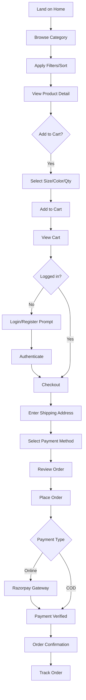
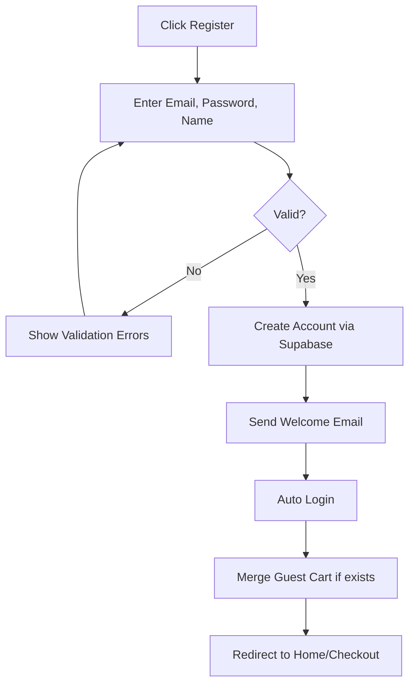
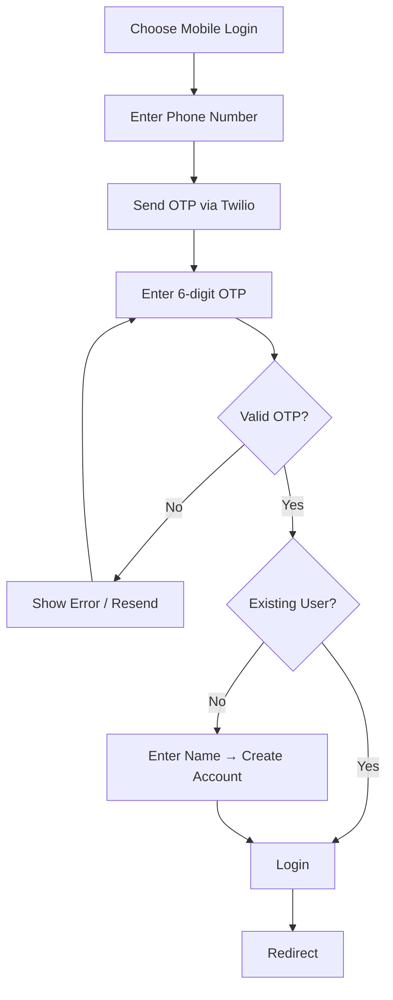
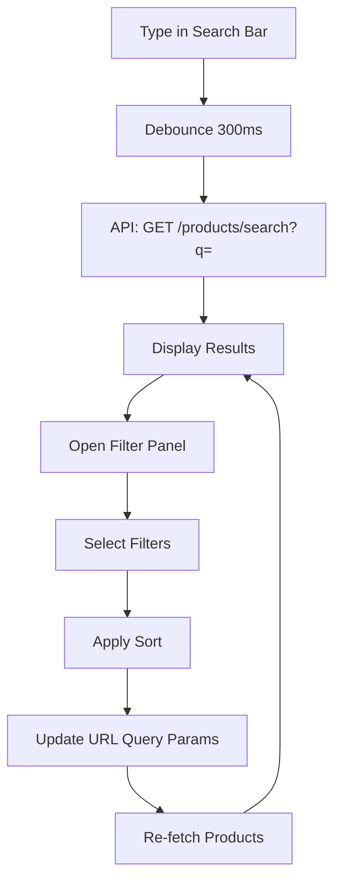
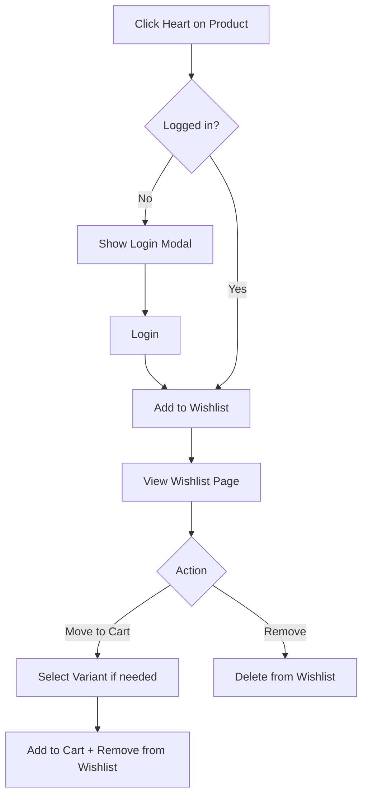
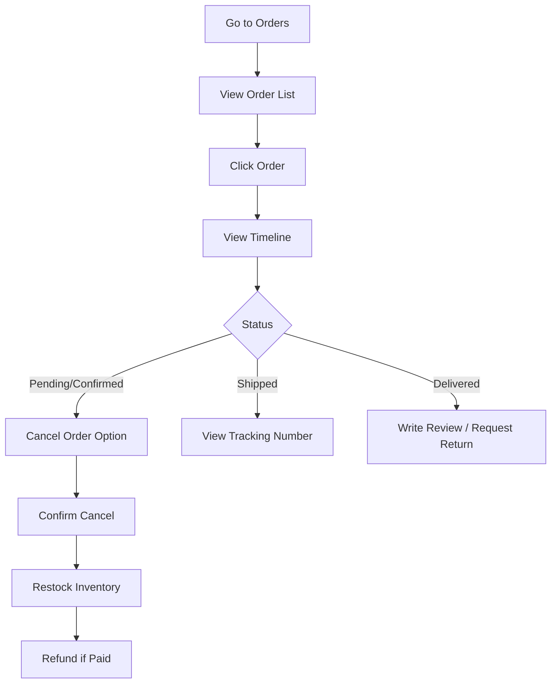
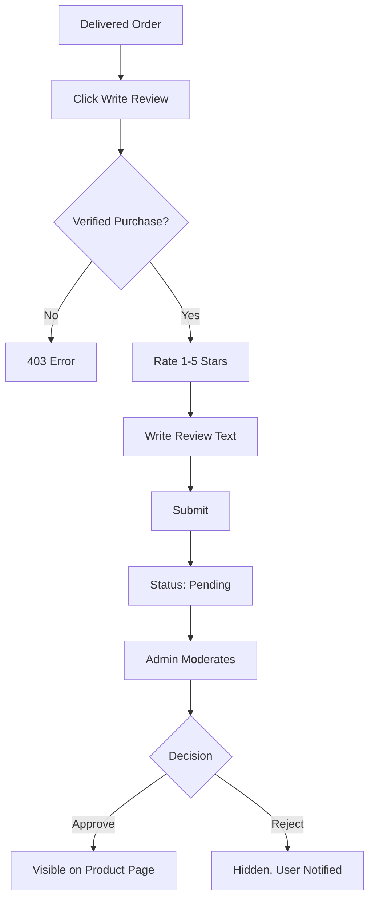
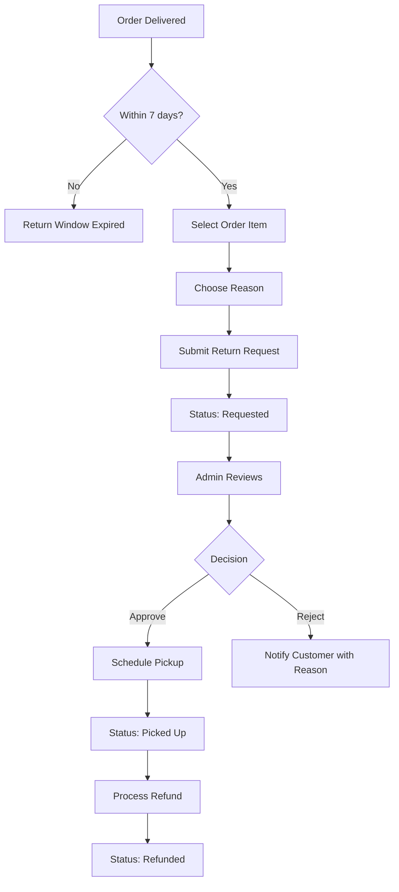
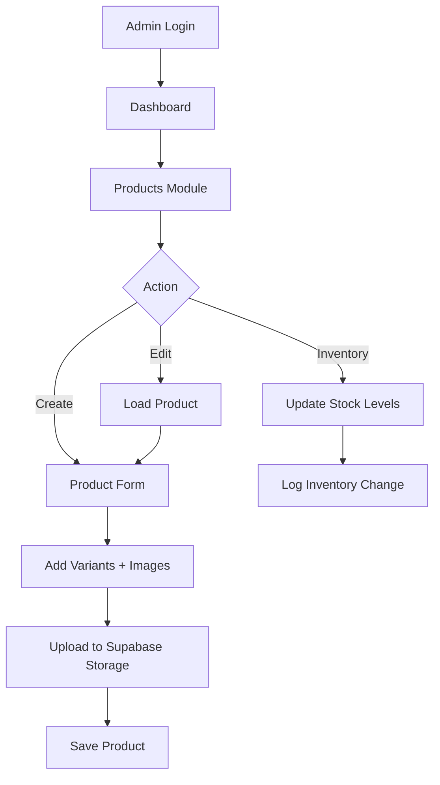
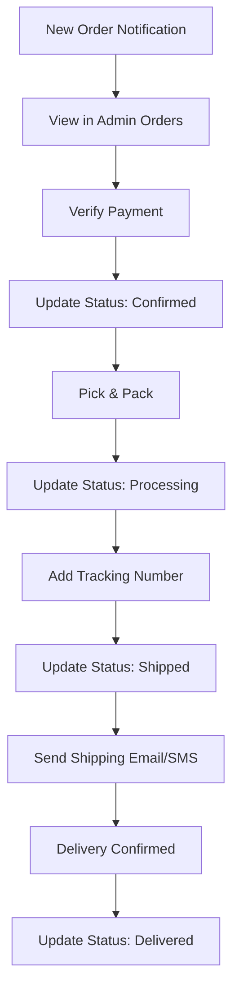

# User Flows
# ClothCart MVP

---

## Flow 1: Guest Browse → Purchase

---

## Flow 2: User Registration (Email)

---

## Flow 3: User Registration (Mobile OTP)

---

## Flow 4: Search & Filter

---

## Flow 5: Wishlist Management

---

## Flow 6: Order Tracking

---

## Flow 7: Product Review

---

## Flow 8: Return Request

---

## Flow 9: Admin Product Management

---

## Flow 10: Admin Order Fulfillment

---

## Edge Cases & Error Flows

| Scenario | Flow |
|----------|------|
| Out of stock at checkout | Block checkout, show OOS items, suggest remove |
| Payment failure | Show retry option, order stays pending |
| Session expired | Redirect to login, preserve cart |
| Invalid pincode | Address validation error, suggest correction |
| Duplicate review | 409 error, show existing review |
| Cancel after shipped | Disable cancel, suggest return flow |
| COD order > ₹5000 | Block COD, suggest online payment |
